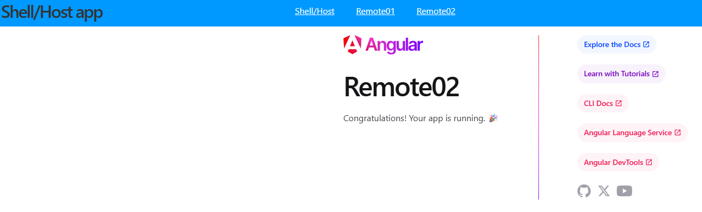

# native-federation
Angular Native Federation proof-of-concept

---

## To run

Open a new Terminal and enter the following commands:

```
cd Remote01
ng serve
```

That will start `Remote01` on port `4201`.

Then repeat for `Remote02`:

Open another Terminal:

```
cd Remote02
ng serve
```

That will start `Remote02` on port `4202`.

Finally, one more Terminal:

```
cd Host
ng serve
```

Which starts the `Host`:
```
http://localhost:4200/
```

And you should see the navigation, linking through to Remote01/Remote02 and the Host itself (`HomeComponent`):

